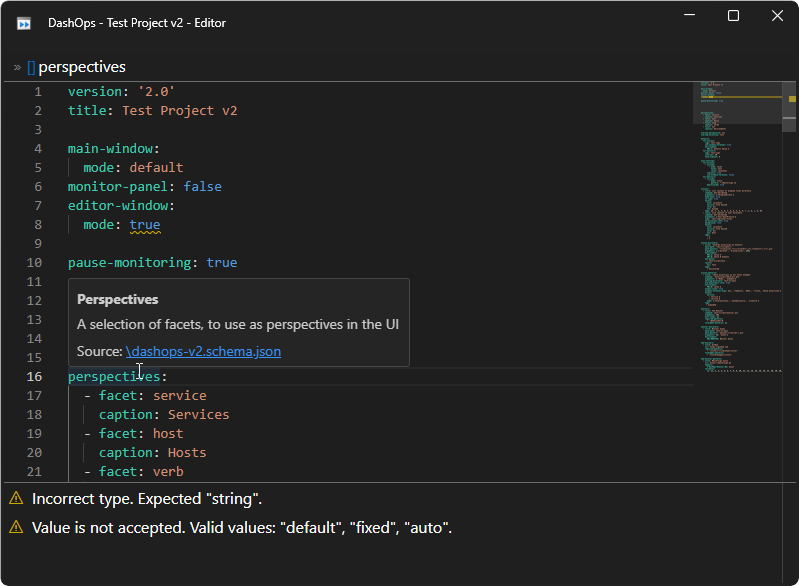

# DashOps

> Control panel for script execution and monitoring on Windows


## Usage

Create a [YAML](https://yaml.org/) file `dashops.yaml` with the following content in your project folder:

```yaml
version: "2.0"
title: My Project Dashboard

perspectives:
  - facet: target
    caption: Targets
  - facet: verb
    caption: Verbs

actions:
  - title: '${verb} ${target}'
    command: dotnet
    arguments: [build]
    facets:
      verb: Build
      target: Project

```

Then start `DashOps.exe` with your project folder as the working directory.
Or start `DashOps.exe` with your `dashops.yaml` file as command line argument.

Edit the `dashops.yaml` file to configure your actions and monitors.
You can use the integrated editor with code completion and descriptive tool tips.
Code completion is activated by <kbd>Ctrl</kbd> + <kbd>Space</kbd>.

## Concepts

To make the most use of _DashOps_, familiarize yourself with the following concepts.

### Facets and Tags

Each action is annotated with facets and tags.

A **facet** is a keyword associated with a value.
E. g. keyword `host` and value `my-server-01.my-domain.com`.

A **tag** is only a keyword.
E. g. _Experimental_ or _Production_.

### Perspectives

Perspectives are a tool to select subsets of actions.

A perspective is either the predefined perspective _Tags_ or user defined facet perspective.
The user defined perspectives are listed in the project property `perspectives`.
A perspective from a facet can have a caption, to show in the UI.

### Actions

Actions are PowerShell commands, script files, or executables.
They are easily executable via a button in the UI.

There are three ways to define actions.

1. **Explicit** actions in the project property `actions`  
   One definition yields one specific action.
2. Action **discovery** in `action-discovery`  
   One definition searches recursively for matching files in a folder and each match yields an action.
   Parts of the matched filesystem path can be used as facet values.
3. Action **patterns** in `action-patterns`  
   The definition includes a sequence of values for one or multiple facets.
   Each combination of the facet values yield an action.

### Monitors

Monitors are checks, periodically run in the background.
DashOps supports two kinds of monitors: Command monitors and Web monitors.
Command monitors execute a PowerShell command, a script, or an executable like an action.
Web monitors send an HTTP GET request.
The result or response is checked for success or failure
and the monitor visualizes the last result state.

Command Monitors can be defined like actions.

1. **Explicit** Command monitors in the project property `monitors`  
   One definition yields one specific Command monitor.
2. Command monitor **discovery** in `monitor-discovery`  
   One definition searches recursively for matching files in a folder and each match yields a command monitor.
   Parts of the matched filesystem path can be used as variables in the title, command, arguments, etc.
3. Command monitor **patterns** in `monitor-patterns`  
   The definition includes a sequence of values for one or multiple variables.
   Each combination of the variable values yield a command monitor.

Web Monitors can be defined in two ways.

1. **Explicit** web monitors in the project property `web-monitors`  
   One definition yields one specific web monitor.
2. Web monitor **patterns** in `web-monitor-patterns`  
   The definition includes a sequence of values for one or multiple variables.
   Each combination of the variable values yield a web monitor.

## Logging

By default the output of actions and monitors is logged in text files.
The location of the log directory can be customized on project level,
or for each action or monitor individually.

The name of a log file encodes, if the action or monitor execution was successful.

## Screenshots

The following screenshot shows the main window.
Selection of actions is done by perspective (_Tags_, _Services_, _Hosts_, ...)
and facet values (`File System`, `service A`, ...).
Currently actions with facet `service` = `service A` are selected.
The monitor panel on the right side is currently hidden,
but can be revealed by clicking the button in the top right corner of the window.


The following screenshot shows the integrated editor.
As an example for error messages the property `editor-window.mode: true` is invalid,
which is explained in the messages at the bottom.
Hovering the mouse cursor over properties, shows a brief description.


